# 基于Springboot的小徐影城管理系统

## Springboot-0033


## 技术栈

Springboot mybatisplus vue mysql maven


## 数据库表(14张)


## 功能介绍

```properties
管理员：首页、个人中心、用户管理、电影类型管理、放映厅管理、电影信息管理、购票统计管理、系统管理、订单管理，

用户
前台；首页、电影信息、电影资讯、个人中心、后台管理、在线客服等功能。
```


## 图片

### 前台


### 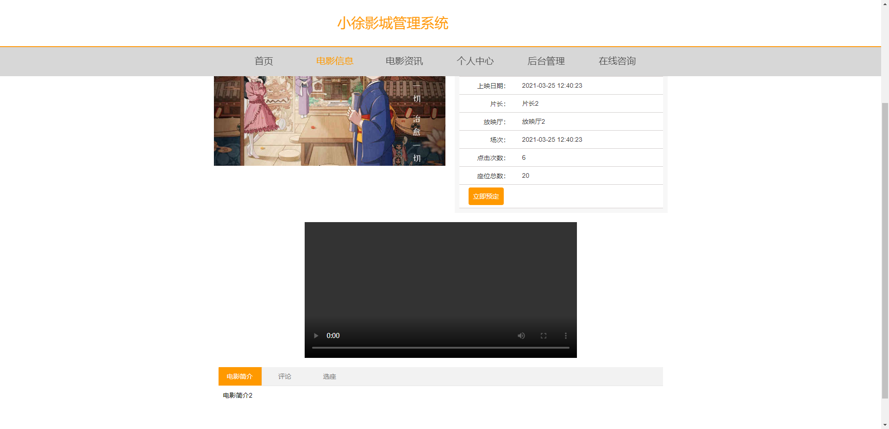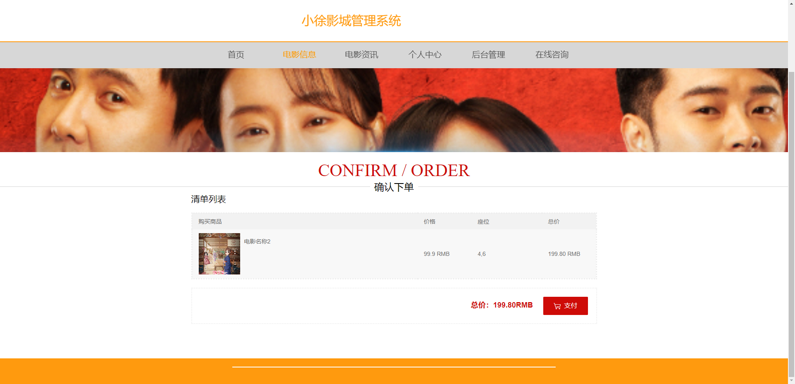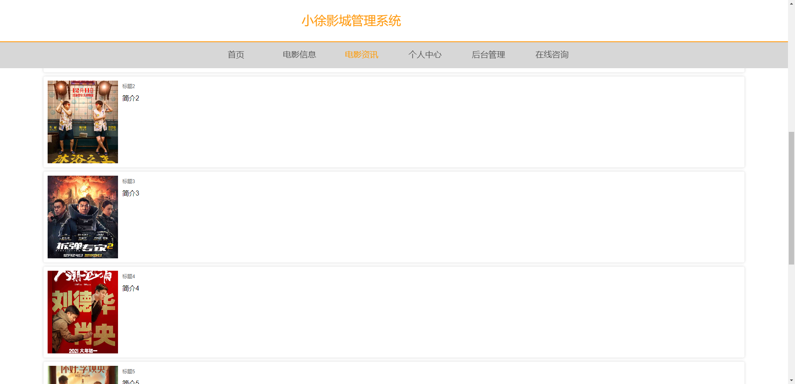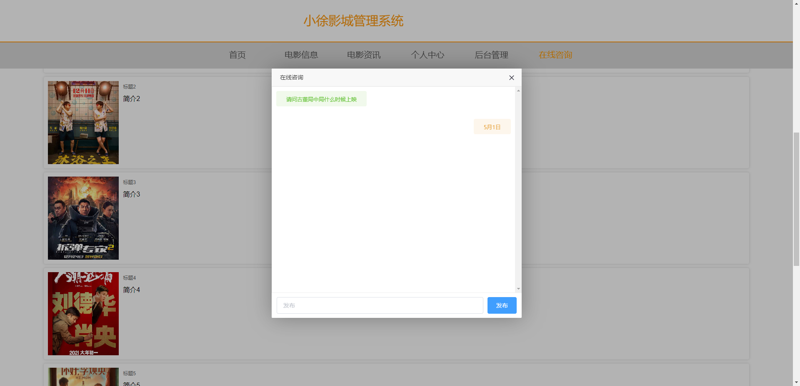后台

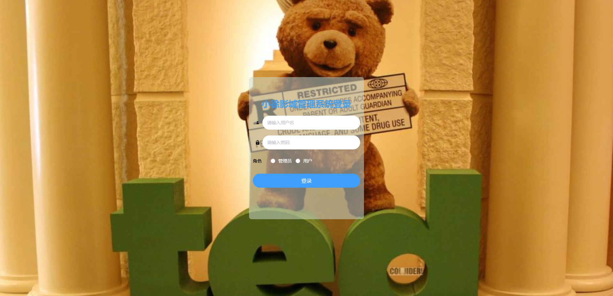

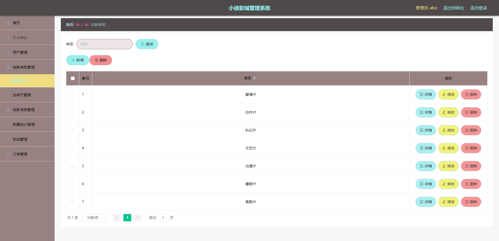

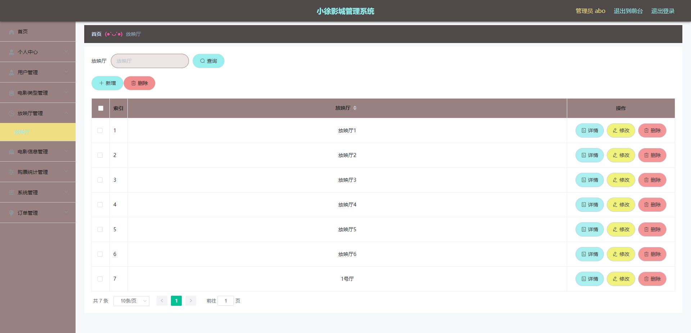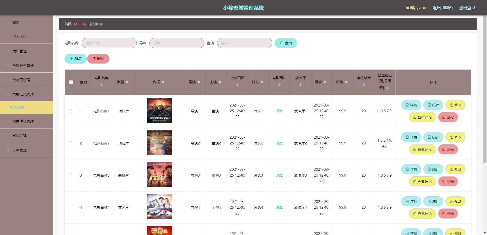

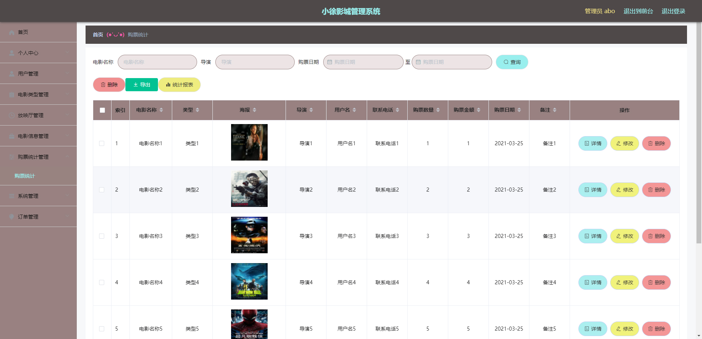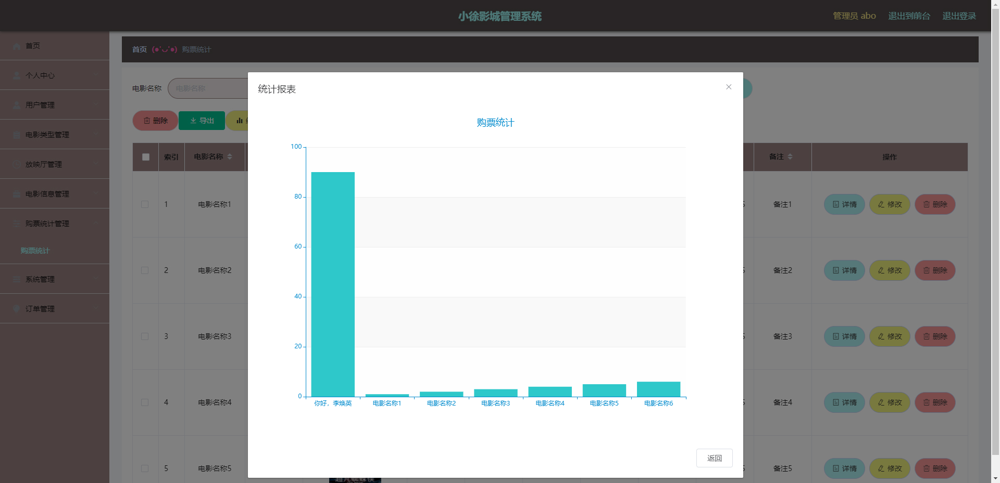


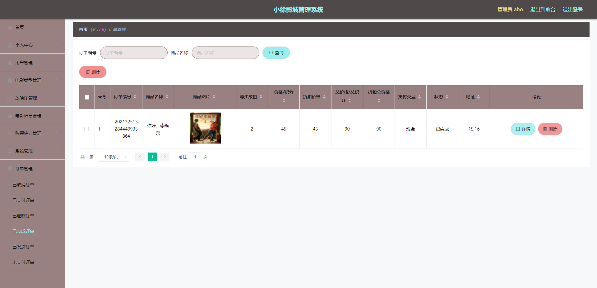

## 访问路径

### 前台

```properties
http://localhost:8080/springbootm3kwm/front/pages/login/login.html

账号 1
密码 1
```

### 后台

```properties
http://localhost:8080/springbootm3kwm/admin/dist/index.html#/login

账号 abo
密码 abo
```


## 功能图

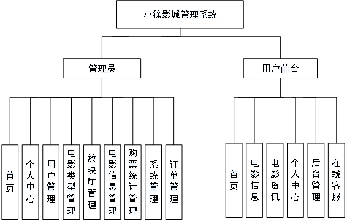


## 文档目录

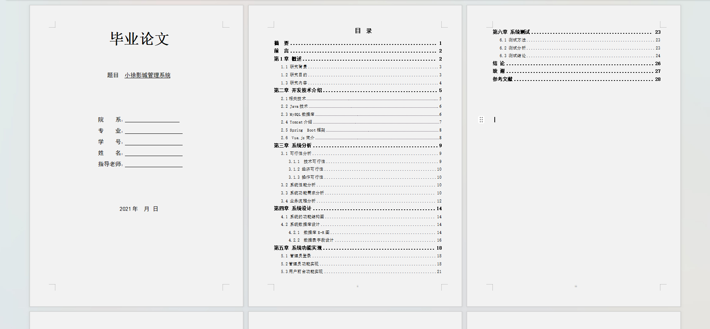


## 打赏或交流


